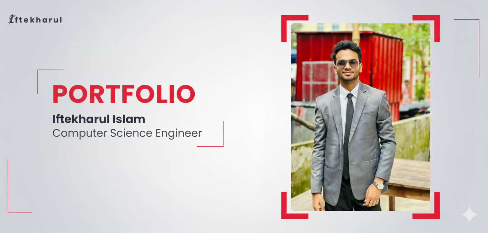
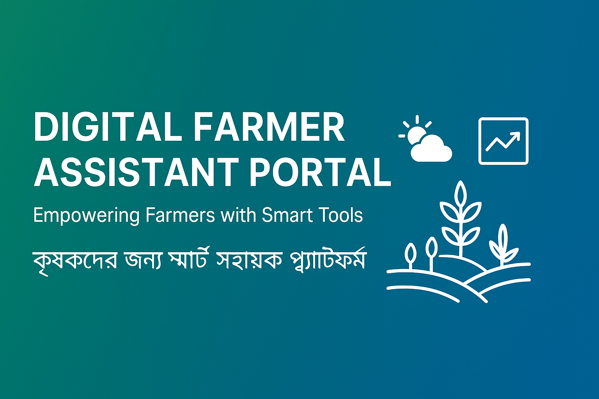
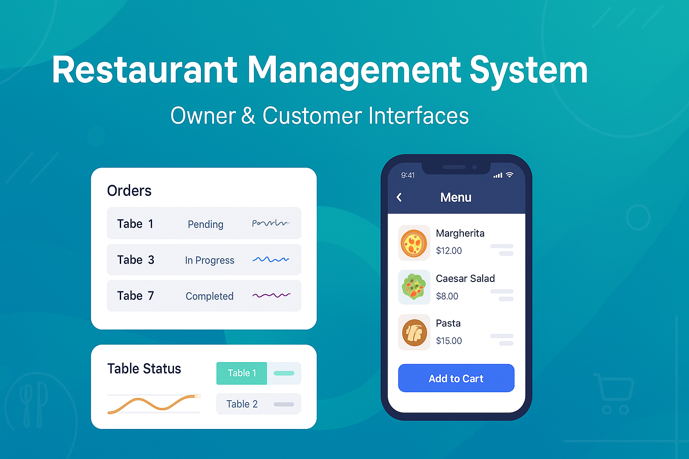

<!--- 

  

--->
<h1 align="center">Hi 👋, I'm Iftekharul Islam</h1>
<h3 align="center">Final-year Computer Science and Engineering Student | Aspiring Data Scientist</h3>

  🎓 Passionate about <b>Data Science</b> & <b>Artificial Intelligence</b>  
  💡 My goal is to apply <b>data-driven solutions</b> to real-world challenges  
  📚 I also enjoy <b>teaching and sharing knowledge</b> to inspire others

---

## 🛠️ Tech Stack  

  
  
  
  

  
  

---

## 📌 Featured Projects  

<table>
<tr>
<td align="center">
  <a href="https://github.com/iftekharul01/Full-Stack-Dynamic-Portfolio-.git">
    
     <b>🌐 Portfolio</b>
  </a>
  
A Laravel-based portfolio website with responsive design, Google OAuth, and interactive sections.

</td>
<td align="center">
  <a href="https://github.com/iftekharul01/digital_farmer_assistant_portal.git">
    
     <b>🌾 কৃষক পোর্টাল</b>
  </a>
  
Bangla-localized farmer portal with weather updates, tutorials, and market prices.

</td>
</tr>

<tr>
<td align="center">
  <a href="https://github.com/emtiaz1/on_the_go.git">
    
     <b>📱 On The Go</b>
  </a>
  
Community-driven mobile app for sharing posts, locations, and alerts.

</td>
<td align="center">
  <a href="https://www.figma.com/proto/wYyFCFqXRs3T5XcDA88O54/Page-1?node-id=3-13&p=f">
    
     <b>🍴 Restaurant System</b>
  </a>
  
Prototype with owner dashboard & customer interface for seamless ordering and service.

</td>
</tr>
</table>

---

## 🎯 Current Focus  

- 📊 **Final Year Project on Women Empowerment through E-commerce**  
- ☁️ Expanding expertise in **Cloud Computing, AI, and Machine Learning**  

---

## 📊 GitHub Stats  

  

  
  

---

## 🌐 Connect With Me  

  
  
  
  

---

⭐️ *“Data is the new oil, but only if refined with the right questions and algorithms.”*  

📸 Outside coding, I enjoy **photography** and 🎮 **gaming**.  
